# Approximate "Most Like" Results and Analysis
**Chen Huarong <i@chr.asia>** *11/08/14*

<!-- 
{Syntax quick reference}
Link: [Text](link)  
Image: 
-->

* The found "most like" region was marked with red border.

## Different Inputs

Number of Patches | User Input | Style Input |
--- | --- | --- |
25 | 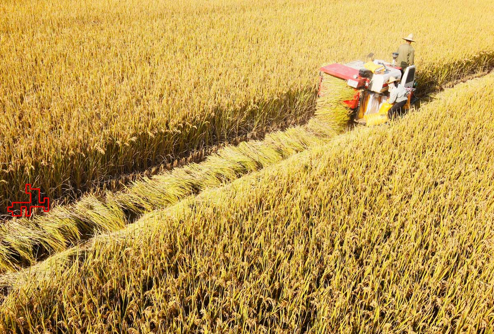 | 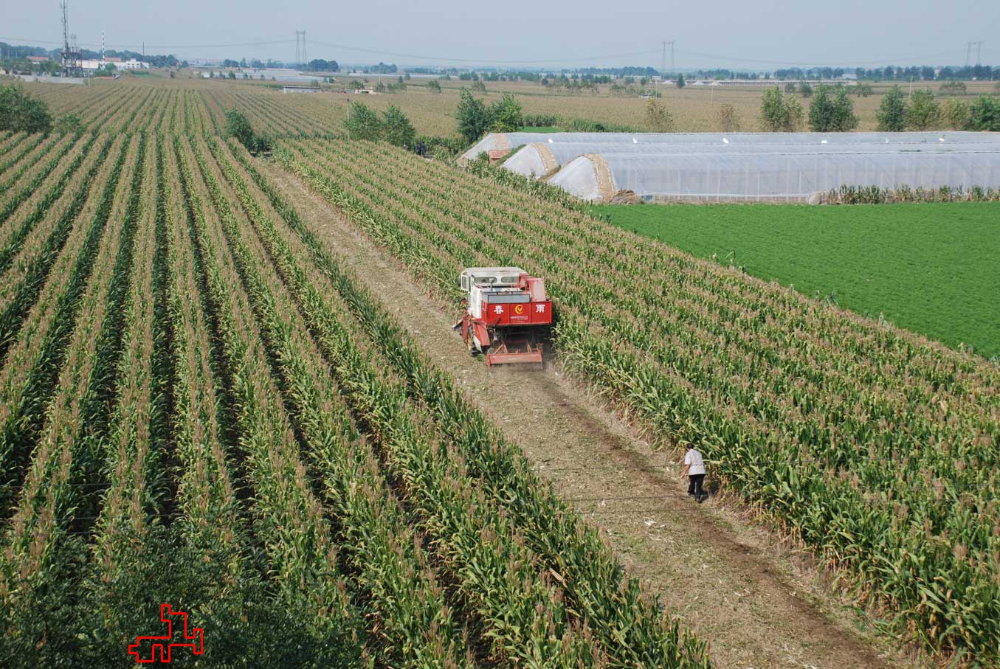 |
245 |  |  |
78 | 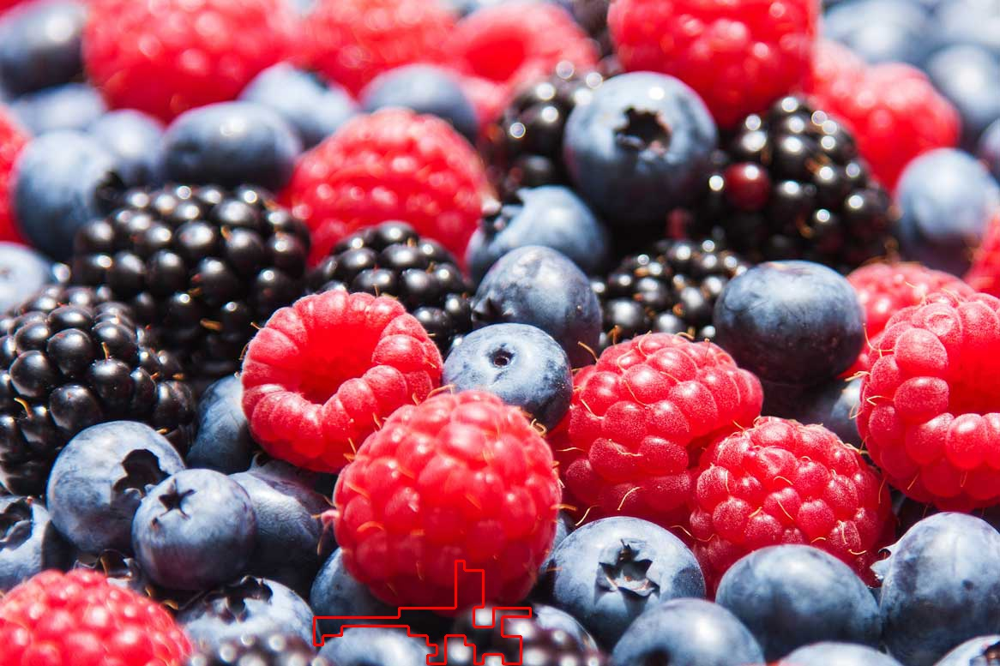 | 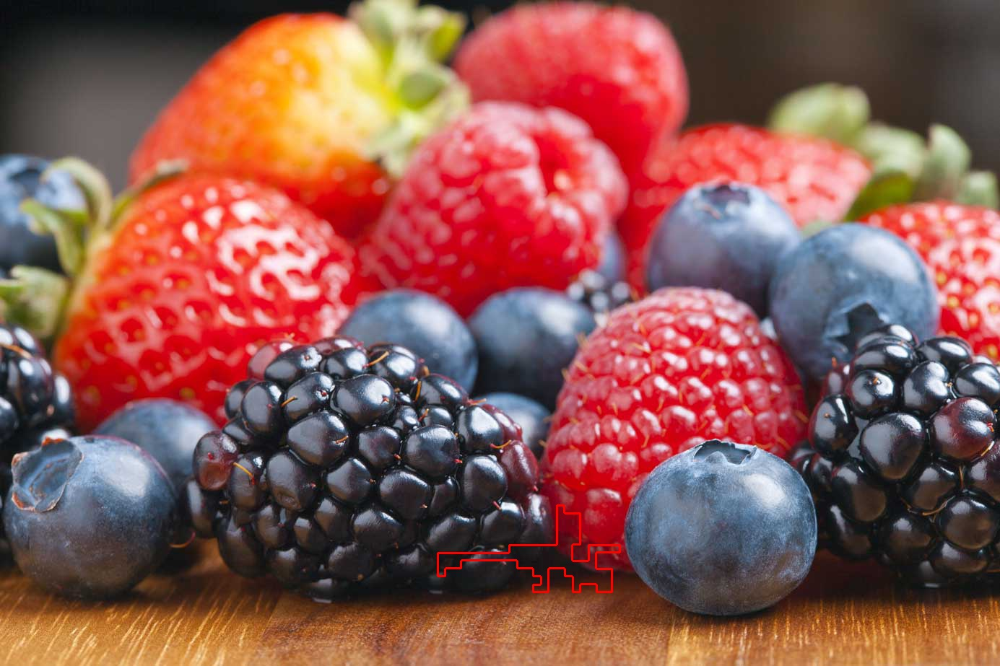 |
362 | 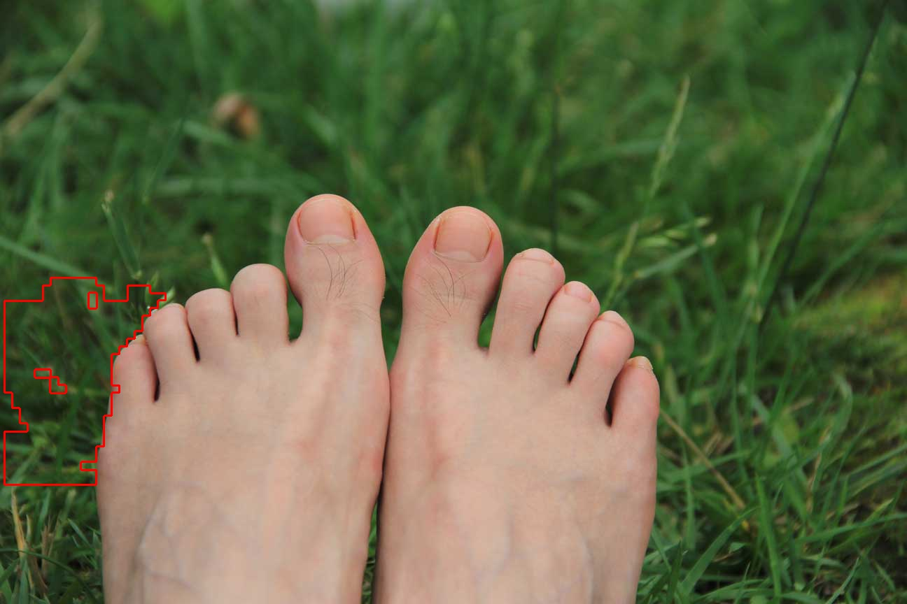 |  |
183 | 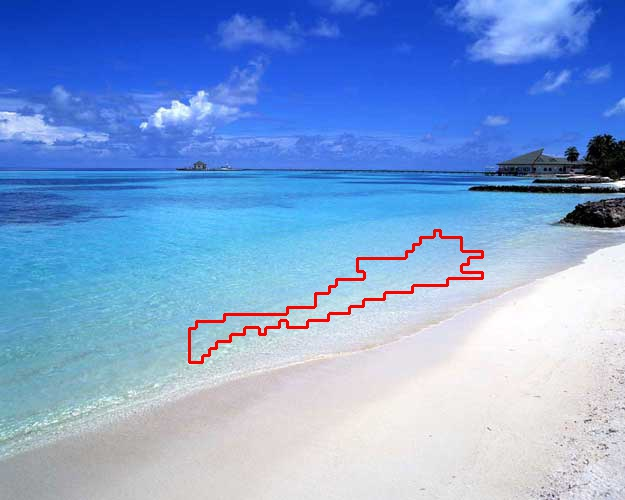 |  |

* The distance is RGB distance - 150 * total of pixels.
* The number of pre-selected seeds is 1024. 

## Different number of pre-selected seeds
### About the elapsed time
Number of Seeds | Elapsed Seconds |
--- | --- |
1024 | &lt;1 |
16384 | 1 | 
65536 | 2 |
131072 | 4 |
262144 | 9 |
524288 | 17 |

* It seems to be $O(n)$.

### Results
Number of Seeds | Number of Patches | User Input | Style Input |
--- | --- | --- | --- |
1024 | 60 | 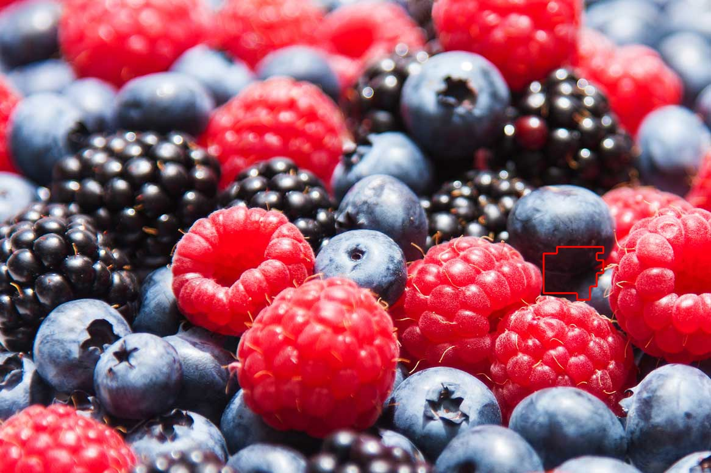 | 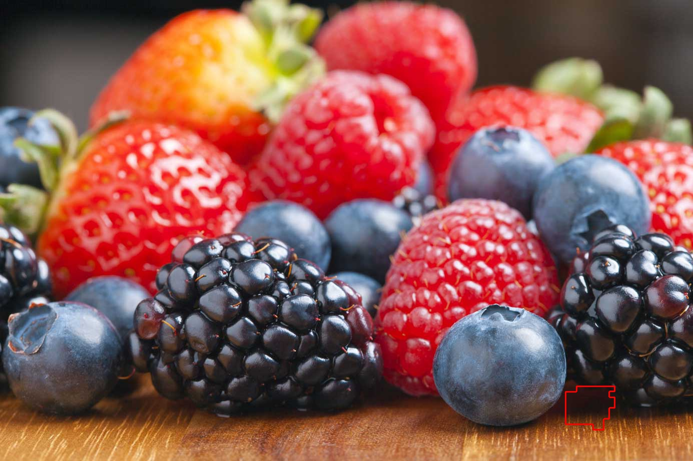 |
65536 | 37 |  |  |
524288 | 107 | 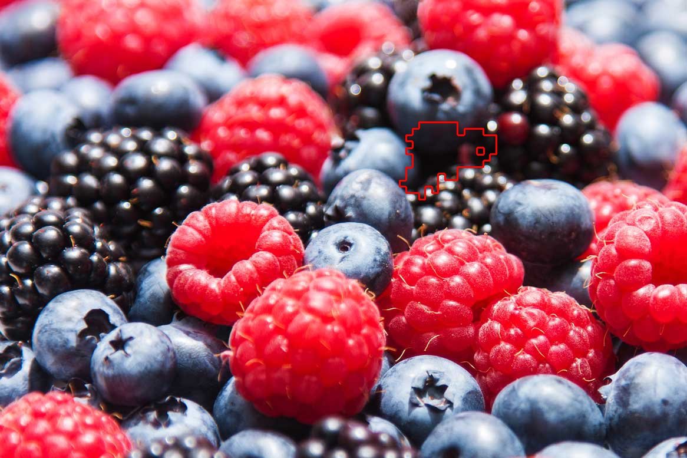 |  |

* The results are similar.

## Different distance functions
Distance Function | Number of Patches | User Input | Style Input |
--- | --- | --- | --- |
RGB | 21 |  | 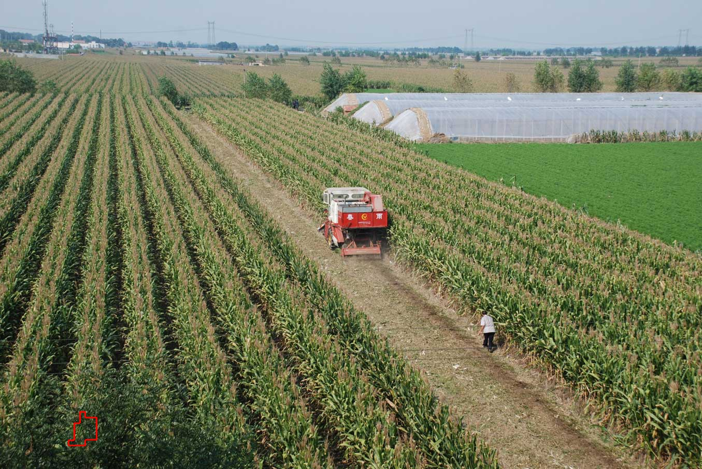 |
Luminance | 74 | 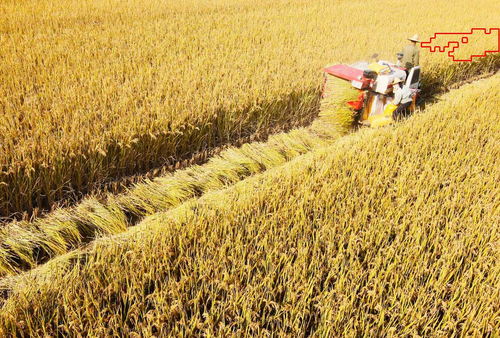 | 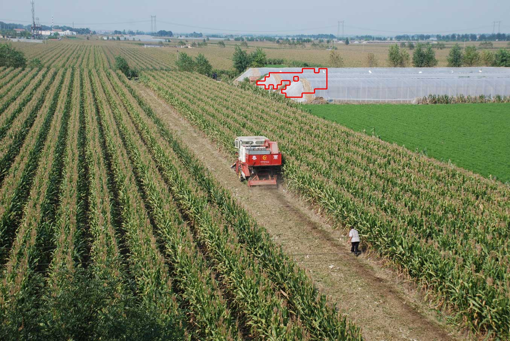 |

* The result with luminance distance is better.