# Patch-ANN Results and Analysis
**Chen Huarong <i@chr.asia>** *11/08/14*

<!-- 
{Syntax quick reference}
Link: [Text](link)  
Image: 
-->

## Construct an existing image using Patch-ANN result

User Input | Style Input | Matched Patch's Centers | Construct Using Matched Patches |
--- | --- | --- | --- |
 |  | 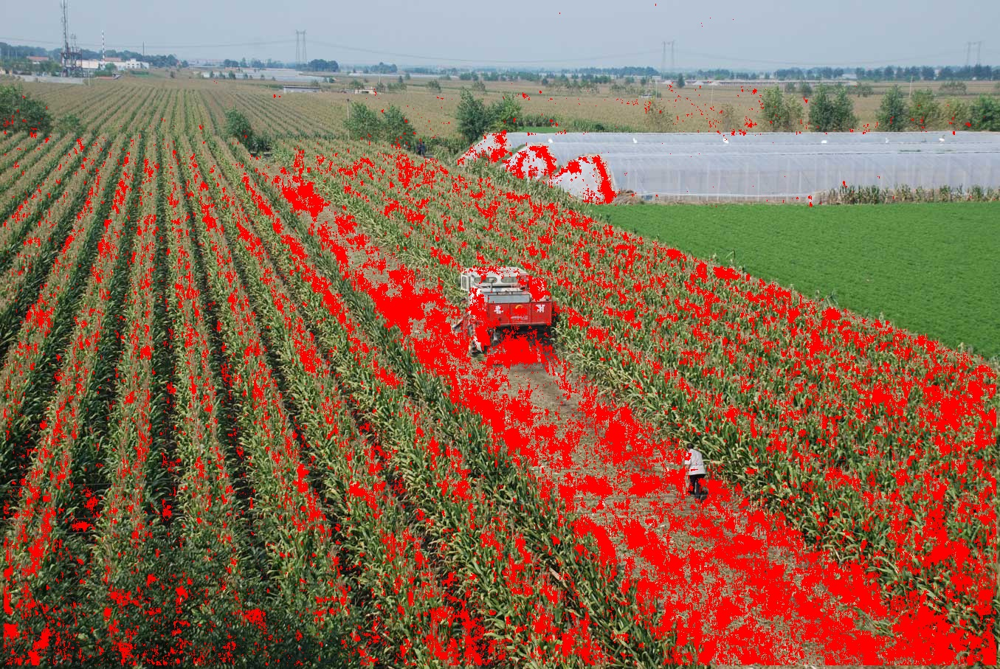 | 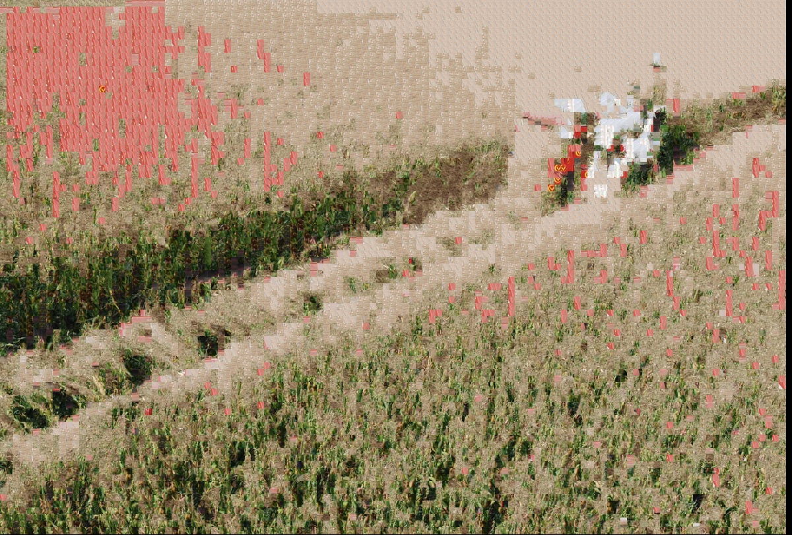 |
 |  |  | 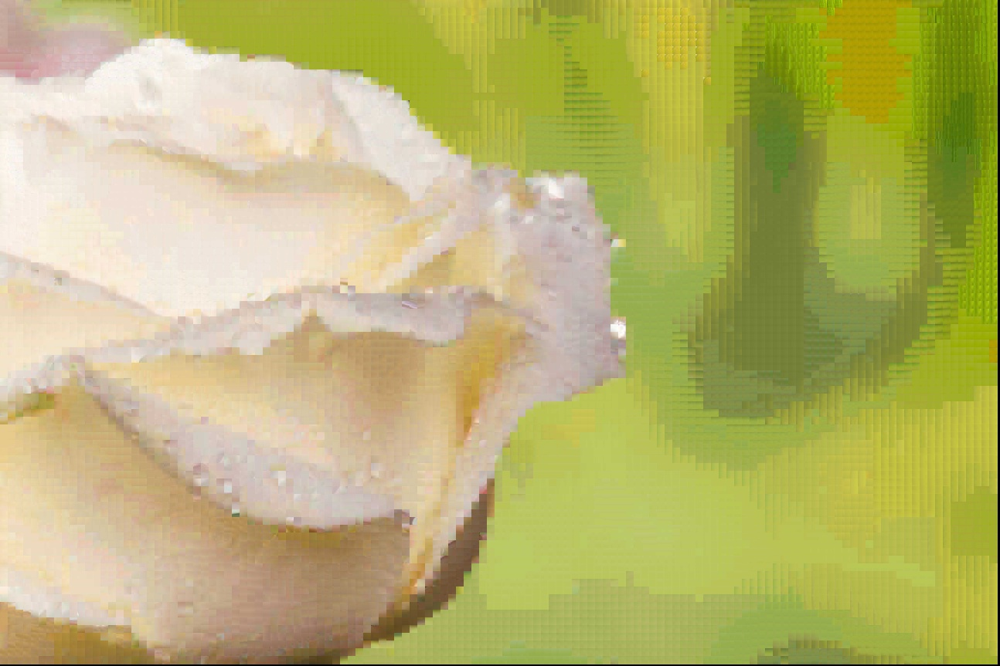 |
 | 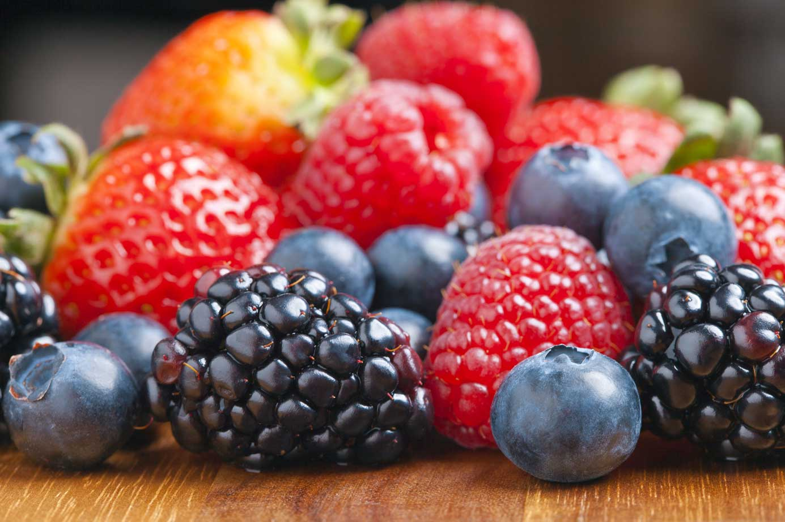 |  | 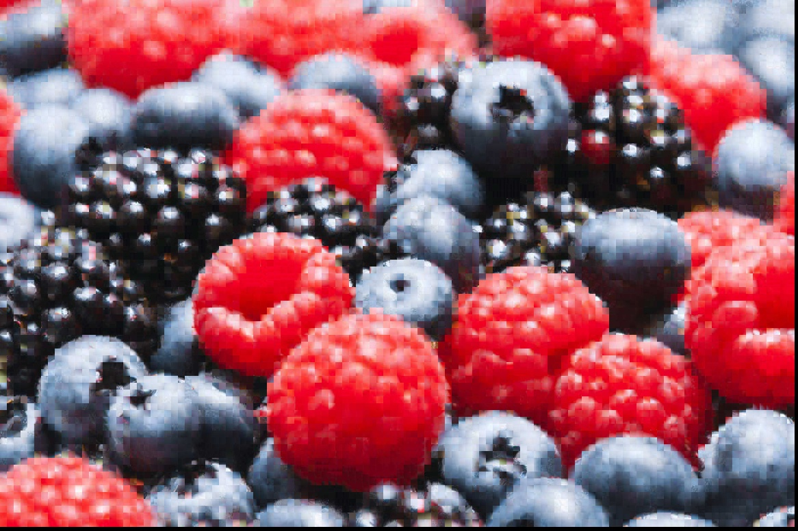 |
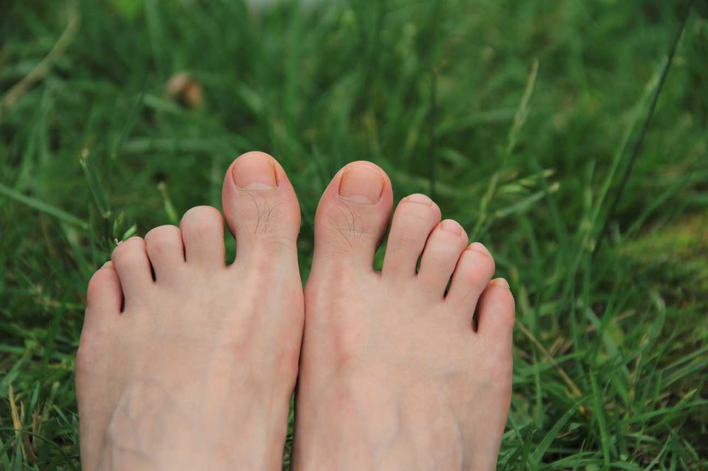 |  |  | 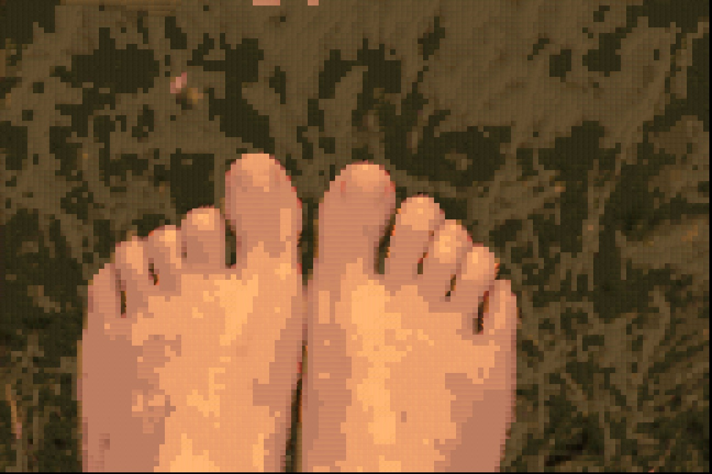 |
 |  |  | 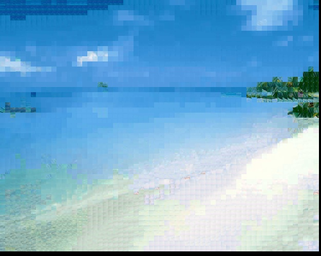 |

* The patch size is set to 11.
* The distance is RGB distance.
* The number of iterations is 5.
* The results above can prove the correctness of my implementation of Patch-ANN.

## Different patch size
### About the elapsed time
Patch Size | Elapsed Seconds |
--- | --- |
3 | 4 |
7 | 13 |
11 | 28 |
21 | 133 |

* The distance is RGB distance.
* The number of iterations is 5.
* Most time was consumed to calculate the distance.

### Construct with different patch size
User Input: 
Style Input: 

Patch Size | Matched Patch's Centers | Construct Using Matched Patches |
--- | --- | --- |
3 | 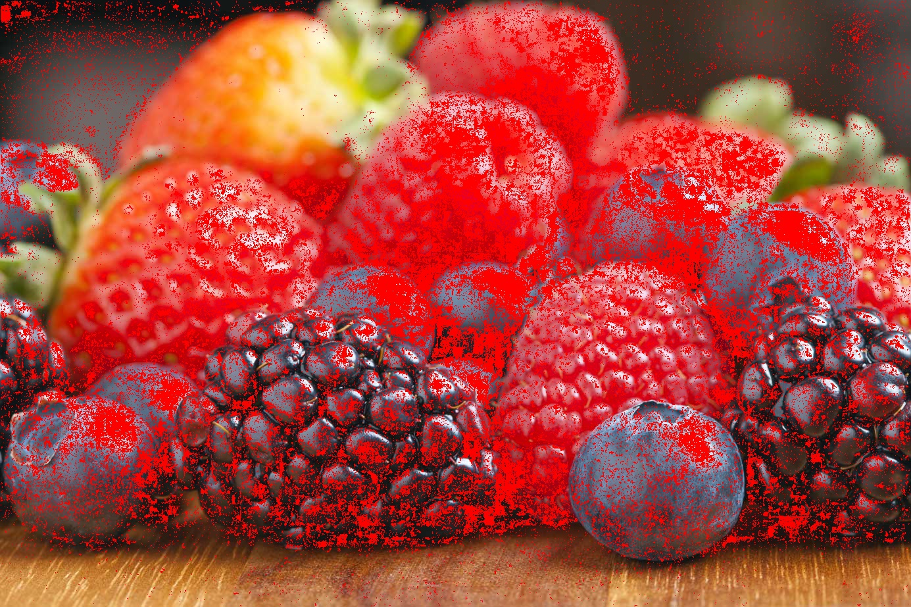 |  |
7 |  |  |
11 | 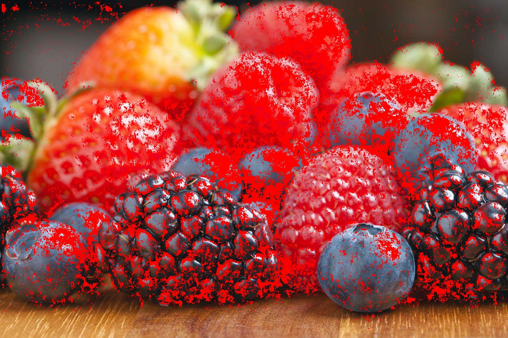 |  |
21 | 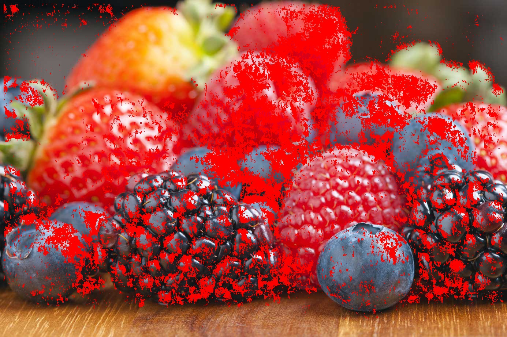 |  |

* The distance is RGB distance.
* The number of iterations is 5.
* For the given image, patch size 11 is suitable for the rest algorithm.

## Different number of iterations
### About the elapsed time
Iterations | Elapsed Seconds |
--- | --- |
1 | 6 |
4 | 21 |
6 | 33 |

### Construct with different number of iterations
Iterations | Matched Patch's Centers | Construct Using Matched Patches |
--- | --- | --- |
1 | 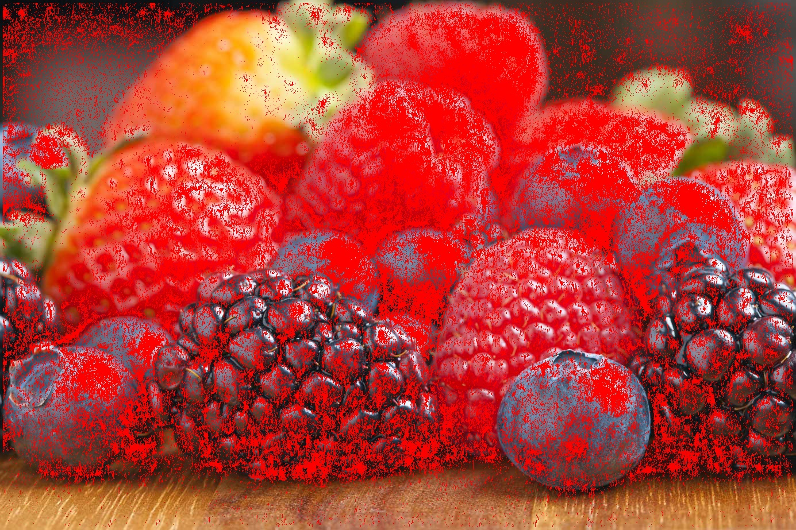 |  |
4 |  |  |
6 |  |  |

* 3-5 iterations are enough.

## Different distance functions
Distance Function | Matched Patch's Centers | Construct Using Matched Patches |
--- | --- | --- |
RGB |  | 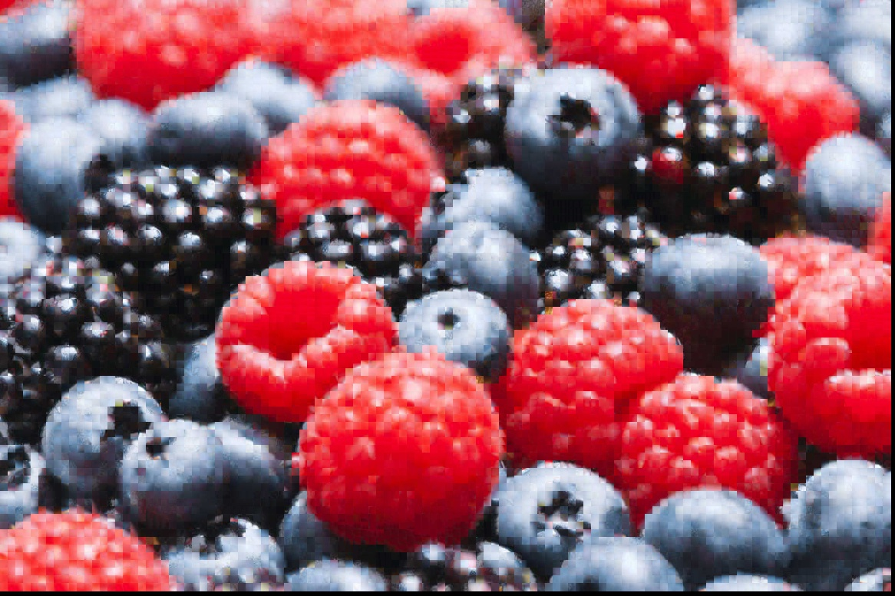 |
Luminance |  | 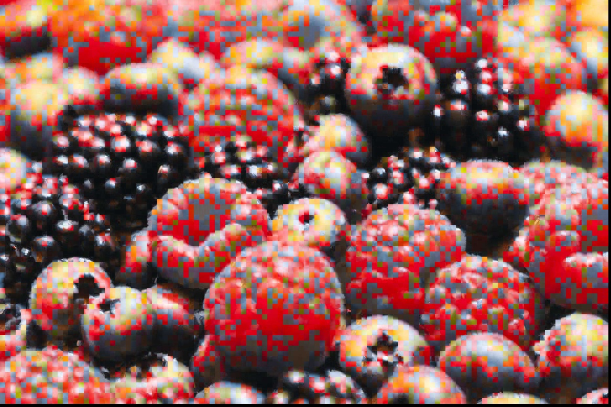 |