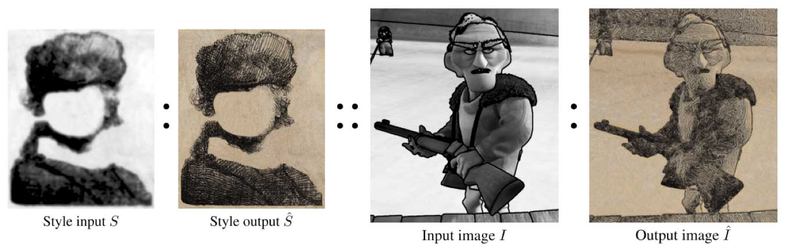
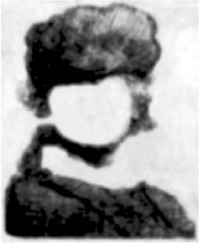
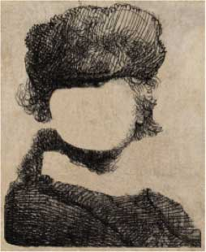
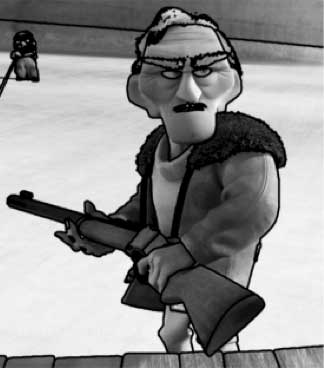
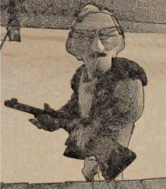
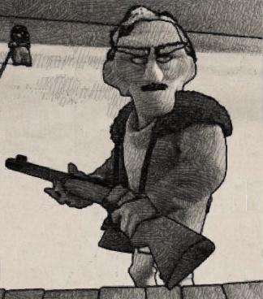
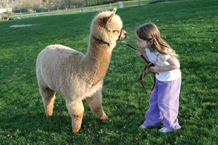
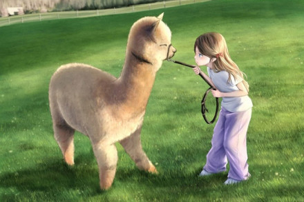
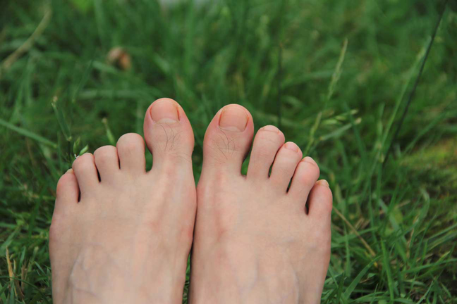
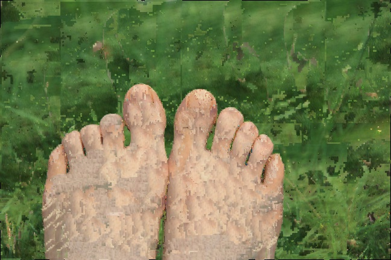

# Weekly Report: Week 4 (11/08/14 - 17/08/14)
**Chen Huarong <i@chr.asia>** *18/08/14*

<!-- 
{Syntax quick reference}
Link: [Text](link)  
Image: 
-->

## 1. Summary
* (Topic) I did some survey about **counting objects in images**.
* (Project) My project about **example based stylization** has some new progresses. I tried to synthesize the "most like" regions obtained in previous steps. The synthesized image of my current completions can preserve the style from given style images but does not have spatial continuity for the time being.

## 2. New Topic: Counting Problem
Prof. Wang advised a new topic, **counting objects in images**, to me according to my completion about finding approximate "most like" regions in images.

After the group meeting, I did some surveys about it.

This problem is a hot topic in Computer Vision. Most of the related papers are solving this problem by machine learning methods. For example, Lempitsky's work[\[1\]](#ref1) uses "density learning" and defines an pixel-based distance function to train the counting model.

Before the popularity of machine learning, there are also some researches trying to solve the counting problem. For example, Sossa's work[\[2\]](#ref2) concentrates on counting objects by the skeleton of images, and achieved a high accuracy of 94%, but I don't think it is a general solution because it is heavily relied on the accuracy of the skeleton.

Perhaps it will be faster or more accurate if we count in the approximate "most like" regions, but I haven't do experiments about it.
 
## 3. Main Topic: Stylization
### 3.1. Review

My project is about **example based stylization**. As shown in the above picture, we have style images $S$ and $\hat{S}$, which were drawn by artists. Also, we have an image $I$ which will be stylized into $\hat{I}$ according to $S$ and $\hat{S}$.

Previous works about this problem are pixel-based or patch-based, which need a long time to get results even with GPU accelerations.

To speed it up, I designed a new algorithm that synthesizing in the approximate "most like" regions. To my understanding, we can consider less about adjacent areas if we are synthesizing inner areas in a big region, which may save a lot of time.

To take this idea into practice, I designed a new algorithm. It has 3 main steps:

1. Find an approximate "most-like" region in given $I$ and $S$.
2. Synthesize the corresponding region in $\hat{I}$.
3. Break the input image up into several "most like" regions and synthesize them using the algorithms in step 1 and 2, and combine the results after that.

Up to now, these steps are all done.

### 3.2. Completions, Observations & Thoughts
I finished step 2 and 3 in my algorithm this week.

#### 3.2.1. "Most Like" Regions Segmentation
In the algorithm, there are iterations of finding "most like" regions, and the whole image will be segmented into several regions after that.

In every iteration, the algorithm will try to find an approximate "most like" region in the unsegmented image areas. After some iterations, the whole image will be segmented and there will be only small areas that were not segmented.

#### 3.2.2. Synthesizing
##### 3.2.2.1. Single Region
I tried a brute-force synthesizing method and got good results in some images from published papers.

A given region in $\hat{I}$ was synthesized pixel-by-pixel and simply use the means of corresponding pixels in $I$ and $\hat{S}$.
	
The results are presented in section 3.2.3.

##### 3.2.2.2. Whole Image
There will be overlaps between adjacent "most like" regions and the synthesized result is the means of all corresponding pixels in all related regions.

After the "most like" regions segmentation, there will be small areas that were not segmented. In these areas, the synthesizing is pixel-based, which is a simplified version of the method of Hertzmann's work[\[3\]](#ref3).

#### 3.2.3. Present Results
I tried my algorithm using the images $S$, $\hat{S}$ and $I$ from Bénard's work[\[4\]](#ref4) as input. The results of Bénard's and mine are presented below.

Style Input | Style Output | User Input |
--- | --- | --- |
 |  |  |

 Bénard's Result | My Result |
 --- | --- |
  |  |
 
Bénard's result was synthesized without contours. 

From above pictures, I think that Bénard's result is better in the overall color and my result is better in the texture.

I also tried a group of pictures from the Internet, but can not get a good result.

Style Input | Style Output |
--- | --- |
 |  |

User Input | My Result |
--- | --- |
 |  |

As shown above, my result is bad. But I found that the overall color and style are correct. The result looks bad because I haven't considered spatial continuity in synthesizing.

### 3.3. Difficulties & Plans
Spatial continuity must be considered because it can greatly improve our visual perception.

Luckily, previous works, like [\[3\]](#ref3) and [\[4\]](#ref4), have already purposed solutions about it.

This week I plan to add the consideration of spatial continuity in my synthesizing method and optimize the algorithm in terms of efficiency.

## 4. References
[1] Lempitsky V, Zisserman A. Learning to count objects in images[C]//Advances in Neural Information Processing Systems. 2010: 1324-1332.

[2] Sossa H, Guzman G. New method to count objects into an image[C]//Pattern Recognition, 2000. Proceedings. 15th International Conference on. IEEE, 2000, 1: 470-472.

[3] Hertzmann A, Jacobs C E, Oliver N, et al. Image analogies[C]//Proceedings of the 28th annual conference on Computer graphics and interactive techniques. ACM, 2001: 327-340.
	
[4] Bénard P, Cole F, Kass M, et al. Stylizing animation by example[J]. ACM Transactions on Graphics (TOG), 2013, 32(4): 119.
