# Weekly Report: Week 5 (18/08/14 - 24/08/14)
**Chen Huarong <i@chr.asia>** *25/08/14*

<!-- 
{Syntax quick reference}
Link: [Text](link)  
Image: 
-->

## 1. Summary
* I implemented 3 different synthesizing methods about **example based stylization**.
* In this report, I will present their results and do some comparisons and analysis.

## 2. Problem Background
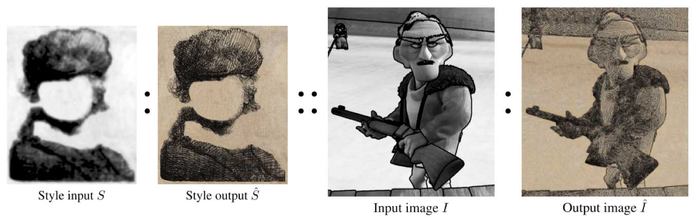
As shown in the figure above, **example based stylization** is a method of **image analogy**. It can apply an existing style, which is described by style input $S$ and output $\hat{S}$, to an input image $I$ and synthesize the output image $\hat{I}$.
	
In the past 4 weeks, I tried to synthesize $\hat{I}$ by segmenting $I$ into some "most like" regions and synthesize in the regions independently.

Following is a result synthesized a week ago.

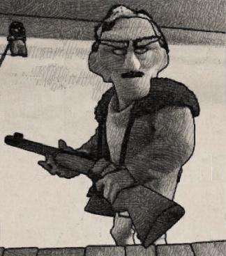

## 3. Three Synthesizing Methods
The result above has no consideration of spatial coherence. I tried 3 different synthesizing methods with spatial coherence consideration.

### 3.0. Spatial Coherence
The stylized output $\hat{I}$ should be spatially as continuous as possible. Usually, spatial coherence is acquired by adding terms describing relations between neighbors.
	
In the following 3 methods, spatial coherence term is described by the similarity of small patch(with patch size of 1 to 3) in $I$ and its correspondence patch in $S$.

### 3.1. Pixel-based Synthesizing with "PatchMatch-like" Optimizing
PatchMatch is an algorithm that can find approximate nearest patch neighbor in a short time. It is a process of optimizing and updating. It can be simply described by 3 steps: find a patch, calculate the distance, replace the patch if the distance is smaller.

The pixel-based synthesizing is similar to the PatchMatch's 3 steps. When calculating the distance, we can do synthesis and check if the synthesized result has smaller distance(if not, we can restore the patch before synthesizing).

In the distance function, I take 3 terms into consideration: 

* Distance of RGB between pixel pair in $I$ and $\hat{I}$
* Distance of luminance between pixel in $\hat{I}$ and corresponding pixel in $\hat{S}$
* Similarity of RGB between patches centered with pixel in $I$ and corresponding pixel in $S$

Following are the results:
	
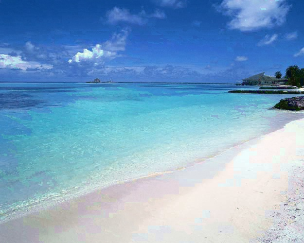 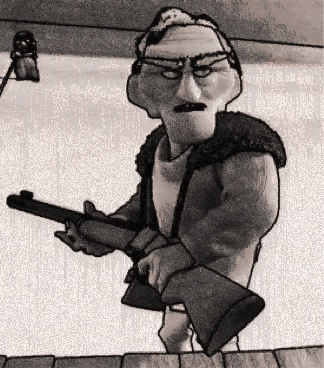

### 3.2. Region-based Synthesizing with Gaussian Blur in Contours
One of my results a week ago(see following) was synthesized by the segmentation of "most-like" regions and the result looks fragmented. Specially, for this result, I applied Gaussian blur in contours of the regions to make it look better.

Before | After |
--- | --- |
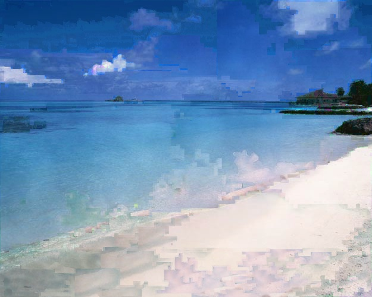 | 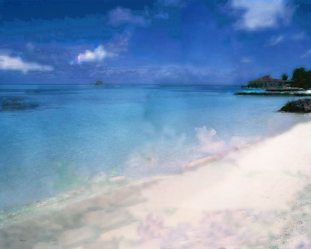 |

Anyhow, the result is not as good as expected. What's more, it is not suitable for stylizations that are strict in preserving details.

### 3.3. Region-based Synthesizing with Random Optimizing
Gaussian blur is helpful in keeping spatial coherence in adjacent areas but will lose details. The biggest weakness of the result synthesized by "most-like" regions is the spatial coherence. To overcome it, I applied a random optimizing that has consideration of spatial coherence and acquired a better result.

The optimization is made up with several iterations. In every iteration, the algorithm randomly choose one "most-like" region and re-synthesize it pixel-by-pixel, taking the similarity of corresponding patches in $I$ and $S$ into consideration.

Followings are results with/without random optimizing.

Without Random Optimizing | With Random Optimizing |
--- | --- |
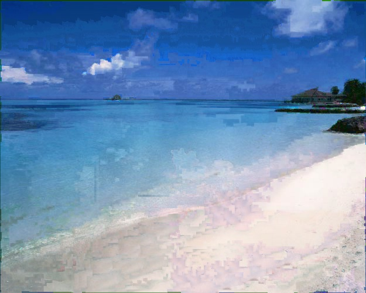 | 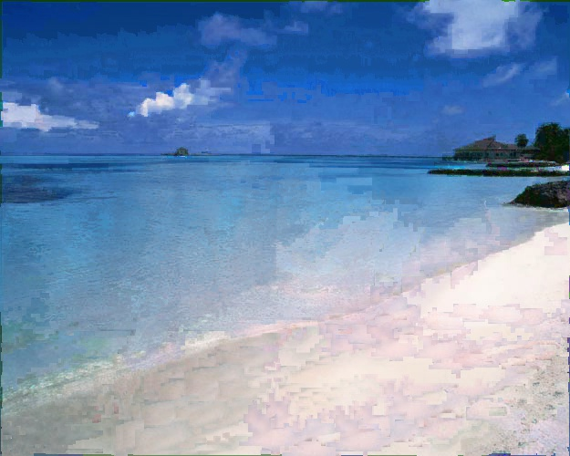 |
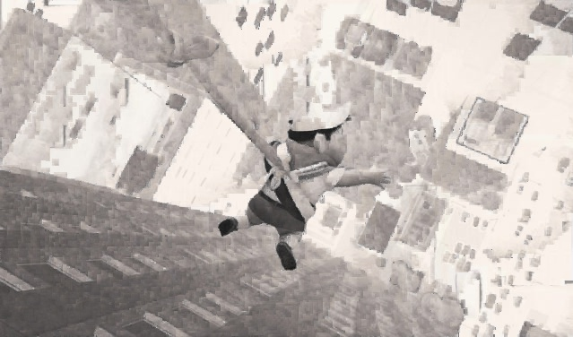 | 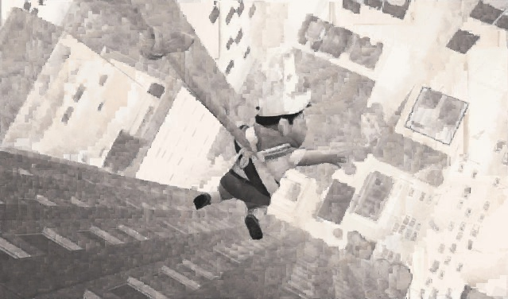 |
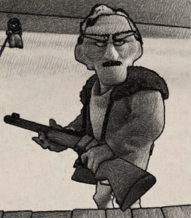 | 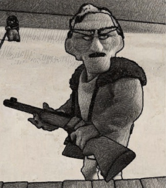 |

### 3.4. Comparisons
By experiments, the advantages and disadvantages of above synthesizing methods are listed as follows:

Method | Advantages | Disadvantages |
--- | --- | --- |
3.1 | Better in the visual perception of colors. | Lose texture. Slow. |
3.2 | Smooth transition in region contours. Can keep texture in inner areas. | Lose details in contours. Has obvious difference between regions. |
3.3 | Good at keeping textures. Keep spatial coherence partially. | Relies heavily on random optimizing. Can not synthesize rotated textures. | 

**Common problems**: The distance function(or energy function) has a significant impact to the results. Finding a good function requires much of experience.
